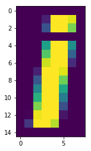
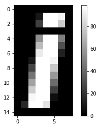
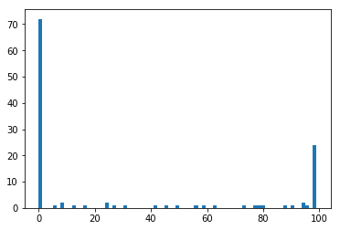
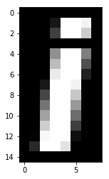
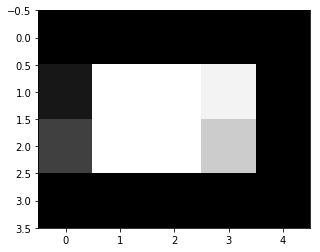

$\newcommand{L}[1]{\| #1 \|}\newcommand{VL}[1]{\L{ \vec{#1} }}\newcommand{R}[1]{\operatorname{Re}\,(#1)}\newcommand{I}[1]{\operatorname{Im}\, (#1)}$

## Arrays as images, images as arrays

You can consider arrays as images, and images as arrays.

We start off with our usual imports:


{:.input_area}
```python
import numpy as np
import matplotlib.pyplot as plt
```


Let’s make an array of numbers between 0 through 99:


{:.input_area}
```python
an_array = np.array([[ 0,  0,  0,  0,  0,  0,  0,  0],
                     [ 0,  0,  0,  9, 99, 99, 94,  0],
                     [ 0,  0,  0, 25, 99, 99, 79,  0],
                     [ 0,  0,  0,  0,  0,  0,  0,  0],
                     [ 0,  0,  0, 56, 99, 99, 49,  0],
                     [ 0,  0,  0, 73, 99, 99, 31,  0],
                     [ 0,  0,  0, 91, 99, 99, 13,  0],
                     [ 0,  0,  9, 99, 99, 94,  0,  0],
                     [ 0,  0, 27, 99, 99, 77,  0,  0],
                     [ 0,  0, 45, 99, 99, 59,  0,  0],
                     [ 0,  0, 63, 99, 99, 42,  0,  0],
                     [ 0,  0, 80, 99, 99, 24,  0,  0],
                     [ 0,  1, 96, 99, 99,  6,  0,  0],
                     [ 0, 16, 99, 99, 88,  0,  0,  0],
                     [ 0,  0,  0,  0,  0,  0,  0,  0]])
an_array.shape
```


{:.output_data_text}
```
(15, 8)
```


In fact this array represents a monochrome picture of a letter.

We can show arrays as images using the `plt.imshow` command from
[matplotlib](http://matplotlib.org/). Here is the default output:


{:.input_area}
```python
plt.imshow(an_array)
```


{:.output_data_text}
```
<matplotlib.image.AxesImage at 0x1097d8080>
```





The image is weirdly colorful. That is because matplotlib is using the default
*colormap*. A colormap is a mapping from values in the array to colors. In
matplotlib < 2.0 the default colormap is called `jet` and maps low numbers
in the image (0 in our case) to blue, and high numbers (99 in our case) to
red. For matplotlib version 2.0 and above the default colormap is called
`viridis`.  `viridis` maps low numbers to purple and high numbers to
yellow.

We can see the relationship of the numbers to the colors by asking matplotlib
to show the colormap:


{:.input_area}
```python
# Nearest interpolation is now the default
plt.imshow(an_array)
plt.colorbar()
```


{:.output_data_text}
```
<matplotlib.colorbar.Colorbar at 0x1098806d8>
```


In our case, our image would make more sense as grayscale, so we use the
`gray` colormap, like this:


{:.input_area}
```python
plt.imshow(an_array, cmap='gray')
plt.colorbar()
```


{:.output_data_text}
```
<matplotlib.colorbar.Colorbar at 0x109922a20>
```





A grayscale image is an array containing numbers giving the pixel intensity
values - in our case between 0 and 99.

Here we set `gray` to the default colormap for the rest of our plots:


{:.input_area}
```python
# Set 'gray' as the default colormap
plt.rcParams['image.cmap'] = 'gray'
```


We can also plot lines in matplotlib. For example, we might want to plot the
values in row 8 from this array.  Because Python indices start at 0, this is
the 9th row of the array.


{:.input_area}
```python
plt.plot(an_array[8])
```


{:.output_data_text}
```
[<matplotlib.lines.Line2D at 0x1099ba6a0>]
```


The x axis is the position in the array (0 through 7) and the y axis is the
value of the array row at that position.

The plot shows us the 0 values at the edges of the bar of the “i”, an the ramp
up to the peak at the middle of the bar of the “i”, in columns number 3 and 4.

A transpose in numpy uses the `.T` method on the array. This has the effect
of flipping the rows and columns (in 2D):


{:.input_area}
```python
an_array.T
```


{:.output_data_text}
```
array([[ 0,  0,  0,  0,  0,  0,  0,  0,  0,  0,  0,  0,  0,  0,  0],
       [ 0,  0,  0,  0,  0,  0,  0,  0,  0,  0,  0,  0,  1, 16,  0],
       [ 0,  0,  0,  0,  0,  0,  0,  9, 27, 45, 63, 80, 96, 99,  0],
       [ 0,  9, 25,  0, 56, 73, 91, 99, 99, 99, 99, 99, 99, 99,  0],
       [ 0, 99, 99,  0, 99, 99, 99, 99, 99, 99, 99, 99, 99, 88,  0],
       [ 0, 99, 99,  0, 99, 99, 99, 94, 77, 59, 42, 24,  6,  0,  0],
       [ 0, 94, 79,  0, 49, 31, 13,  0,  0,  0,  0,  0,  0,  0,  0],
       [ 0,  0,  0,  0,  0,  0,  0,  0,  0,  0,  0,  0,  0,  0,  0]])
```


{:.input_area}
```python
# Defaults of nearest interpolation and gray colormap
plt.imshow(an_array.T)
```


{:.output_data_text}
```
<matplotlib.image.AxesImage at 0x109a1e278>
```


We can also reshape the original array to a 1D array, by stacking all the rows
end to end:


{:.input_area}
```python
old_shape = an_array.shape
a_1d_array = np.reshape(an_array, old_shape[0] * old_shape[1])
a_1d_array
```


{:.output_data_text}
```
array([ 0,  0,  0,  0,  0,  0,  0,  0,  0,  0,  0,  9, 99, 99, 94,  0,  0,
        0,  0, 25, 99, 99, 79,  0,  0,  0,  0,  0,  0,  0,  0,  0,  0,  0,
        0, 56, 99, 99, 49,  0,  0,  0,  0, 73, 99, 99, 31,  0,  0,  0,  0,
       91, 99, 99, 13,  0,  0,  0,  9, 99, 99, 94,  0,  0,  0,  0, 27, 99,
       99, 77,  0,  0,  0,  0, 45, 99, 99, 59,  0,  0,  0,  0, 63, 99, 99,
       42,  0,  0,  0,  0, 80, 99, 99, 24,  0,  0,  0,  1, 96, 99, 99,  6,
        0,  0,  0, 16, 99, 99, 88,  0,  0,  0,  0,  0,  0,  0,  0,  0,  0,
        0])
```


{:.input_area}
```python
a_1d_array.shape
```


{:.output_data_text}
```
(120,)
```


Reshaping the array to one dimension is a common operation, so there is a
separate numpy command for that, `np.ravel`:


{:.input_area}
```python
np.ravel(an_array)
```


{:.output_data_text}
```
array([ 0,  0,  0,  0,  0,  0,  0,  0,  0,  0,  0,  9, 99, 99, 94,  0,  0,
        0,  0, 25, 99, 99, 79,  0,  0,  0,  0,  0,  0,  0,  0,  0,  0,  0,
        0, 56, 99, 99, 49,  0,  0,  0,  0, 73, 99, 99, 31,  0,  0,  0,  0,
       91, 99, 99, 13,  0,  0,  0,  9, 99, 99, 94,  0,  0,  0,  0, 27, 99,
       99, 77,  0,  0,  0,  0, 45, 99, 99, 59,  0,  0,  0,  0, 63, 99, 99,
       42,  0,  0,  0,  0, 80, 99, 99, 24,  0,  0,  0,  1, 96, 99, 99,  6,
        0,  0,  0, 16, 99, 99, 88,  0,  0,  0,  0,  0,  0,  0,  0,  0,  0,
        0])
```


One use of the 1D version of the array, is for making a histogram of the
distribution of values in the array:


{:.input_area}
```python
plt.hist(a_1d_array)
```


{:.output_data_text}
```
(array([ 75.,   2.,   3.,   1.,   3.,   2.,   1.,   3.,   2.,  28.]),
 array([  0. ,   9.9,  19.8,  29.7,  39.6,  49.5,  59.4,  69.3,  79.2,
         89.1,  99. ]),
 <a list of 10 Patch objects>)
```


By default, the `plt.hist` function uses 50 bins, but you can specify how
many bins you want with the `bins` keyword:


{:.input_area}
```python
plt.hist(a_1d_array, bins=75)
```


{:.output_data_text}
```
(array([ 72.,   0.,   0.,   0.,   1.,   0.,   2.,   0.,   0.,   1.,   0.,
          0.,   1.,   0.,   0.,   0.,   0.,   0.,   2.,   0.,   1.,   0.,
          0.,   1.,   0.,   0.,   0.,   0.,   0.,   0.,   0.,   1.,   0.,
          0.,   1.,   0.,   0.,   1.,   0.,   0.,   0.,   0.,   1.,   0.,
          1.,   0.,   0.,   1.,   0.,   0.,   0.,   0.,   0.,   0.,   0.,
          1.,   0.,   0.,   1.,   1.,   1.,   0.,   0.,   0.,   0.,   0.,
          1.,   0.,   1.,   0.,   0.,   2.,   1.,   0.,  24.]),
 array([  0.  ,   1.32,   2.64,   3.96,   5.28,   6.6 ,   7.92,   9.24,
         10.56,  11.88,  13.2 ,  14.52,  15.84,  17.16,  18.48,  19.8 ,
         21.12,  22.44,  23.76,  25.08,  26.4 ,  27.72,  29.04,  30.36,
         31.68,  33.  ,  34.32,  35.64,  36.96,  38.28,  39.6 ,  40.92,
         42.24,  43.56,  44.88,  46.2 ,  47.52,  48.84,  50.16,  51.48,
         52.8 ,  54.12,  55.44,  56.76,  58.08,  59.4 ,  60.72,  62.04,
         63.36,  64.68,  66.  ,  67.32,  68.64,  69.96,  71.28,  72.6 ,
         73.92,  75.24,  76.56,  77.88,  79.2 ,  80.52,  81.84,  83.16,
         84.48,  85.8 ,  87.12,  88.44,  89.76,  91.08,  92.4 ,  93.72,
         95.04,  96.36,  97.68,  99.  ]),
 <a list of 75 Patch objects>)
```





As you can imagine, it’s not hard to go back to the 2D shape, by splitting the
1D array back into 15 rows of 8 values each (and therefore 8 columns):


{:.input_area}
```python
array_back = np.reshape(a_1d_array, (15, 8))
array_back
plt.imshow(array_back)
```


{:.output_data_text}
```
<matplotlib.image.AxesImage at 0x109e6f2e8>
```





In numpy, basic operations like multiplication, addition, comparison, are
always elementwise. For example, this multiplies every array value by 10:


{:.input_area}
```python
an_array * 10
```


{:.output_data_text}
```
array([[  0,   0,   0,   0,   0,   0,   0,   0],
       [  0,   0,   0,  90, 990, 990, 940,   0],
       [  0,   0,   0, 250, 990, 990, 790,   0],
       [  0,   0,   0,   0,   0,   0,   0,   0],
       [  0,   0,   0, 560, 990, 990, 490,   0],
       [  0,   0,   0, 730, 990, 990, 310,   0],
       [  0,   0,   0, 910, 990, 990, 130,   0],
       [  0,   0,  90, 990, 990, 940,   0,   0],
       [  0,   0, 270, 990, 990, 770,   0,   0],
       [  0,   0, 450, 990, 990, 590,   0,   0],
       [  0,   0, 630, 990, 990, 420,   0,   0],
       [  0,   0, 800, 990, 990, 240,   0,   0],
       [  0,  10, 960, 990, 990,  60,   0,   0],
       [  0, 160, 990, 990, 880,   0,   0,   0],
       [  0,   0,   0,   0,   0,   0,   0,   0]])
```


Comparison is also elementwise. For example, this gives True for every value >
50, and False for every value <= 50:


{:.input_area}
```python
an_array > 50
```


{:.output_data_text}
```
array([[False, False, False, False, False, False, False, False],
       [False, False, False, False,  True,  True,  True, False],
       [False, False, False, False,  True,  True,  True, False],
       [False, False, False, False, False, False, False, False],
       [False, False, False,  True,  True,  True, False, False],
       [False, False, False,  True,  True,  True, False, False],
       [False, False, False,  True,  True,  True, False, False],
       [False, False, False,  True,  True,  True, False, False],
       [False, False, False,  True,  True,  True, False, False],
       [False, False, False,  True,  True,  True, False, False],
       [False, False,  True,  True,  True, False, False, False],
       [False, False,  True,  True,  True, False, False, False],
       [False, False,  True,  True,  True, False, False, False],
       [False, False,  True,  True,  True, False, False, False],
       [False, False, False, False, False, False, False, False]], dtype=bool)
```


Matplotlib will treat False as 0 and True as 1, so this is one way of
binarizing the image at a threshold (of 50 in this case):


{:.input_area}
```python
plt.imshow(an_array > 50)
```


{:.output_data_text}
```
<matplotlib.image.AxesImage at 0x109ec04e0>
```


We can slice arrays as we slice strings or lists. The difference for arrays is
that we can slice in any or all dimensions at the same time.  For example, to
get the dot of the “i” it looks (from the numbers at the sides of the ploat)
that we want to the top 4 rows, and the last 5 columns:


{:.input_area}
```python
an_array[0:4, 3:]
plt.imshow(an_array[0:4, 3:])
```


{:.output_data_text}
```
<matplotlib.image.AxesImage at 0x109f10a90>
```





<!-- vim:ft=rst -->
<!-- Course -->
<!-- BIC -->
<!-- Python distributions -->
<!-- Version control -->
<!-- Editors -->
<!-- Python and common libraries -->
<!-- IPython -->
<!-- Virtualenv and helpers -->
<!-- Pypi and packaging -->
<!-- Mac development -->
<!-- Windows development -->
<!-- Nipy and friends -->
<!-- FMRI datasets -->
<!-- Languages -->
<!-- Imaging software -->
<!-- Installation -->
<!-- Tutorials -->
<!-- MB tutorials -->
<!-- Ideas -->
<!-- Psych-214 -->
<!-- People -->
<!-- Licenses -->
<!-- Neuroimaging stuff -->
<!-- OpenFMRI projects -->
<!-- Unix -->
<!-- Substitutions -->
